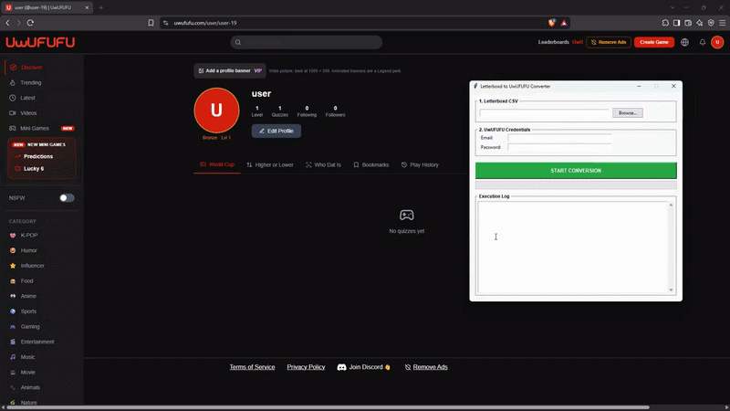

# Letterboxd to UwUFUFU Converter

An open-source Python tool that automatically converts your Letterboxd watched movies diary into an interactive worldcup bracket tournament on UwUFUFU.



## Installation & Usage (Desktop GUI)

### Option A: Use the Pre-built Executable (Recommended)
1. Head over to the **Releases** section of this repository.
2. Download the latest executable file.
3. Double-click to launch the application.

After the tournament is created on UwUFUFU, open it, click **Edit**, and then publish it.

### Option B: Run from Source Code
If you want to run or modify the source code locally, you will need your own TMDb API key.
1. Clone the repository:

   ```bash
   git clone https://github.com/francescoluca/letterboxd-to-uwufufu
   cd letterboxd-to-uwufufu
   ```

2. Set up your environment and install dependencies:

   ```bash
   python3 -m venv venv
   source venv/bin/activate
   pip install -r requirements.txt
   ```
3. Configure your TMDb API Key. Create a file named config.py inside the src/ directory and add your v3 API key:
   ```bash
   # src/config.py
   TMDB_API_KEY = "your_api_key"
   ```
4. Run the application:

   ```bash
   python main.py
   ```
   
## Looking for the CLI version?

If you prefer using the command-line interface (CLI) version of this tool, please check out **v0.1.0** under the **Releases** section of this repository.

## Find a bug?

If you found an issue or would like to submit an improvement to this project, please submit an issue using the **Issues** tab.

## Disclaimer

This tool is a personal open-source side-project. It is not affiliated with, endorsed by, or supported by Letterboxd or UwUFUFU. Use responsibly and respect API rate limits.

## License

Distributed under the MIT License. See [LICENSE](LICENSE) for more information.
